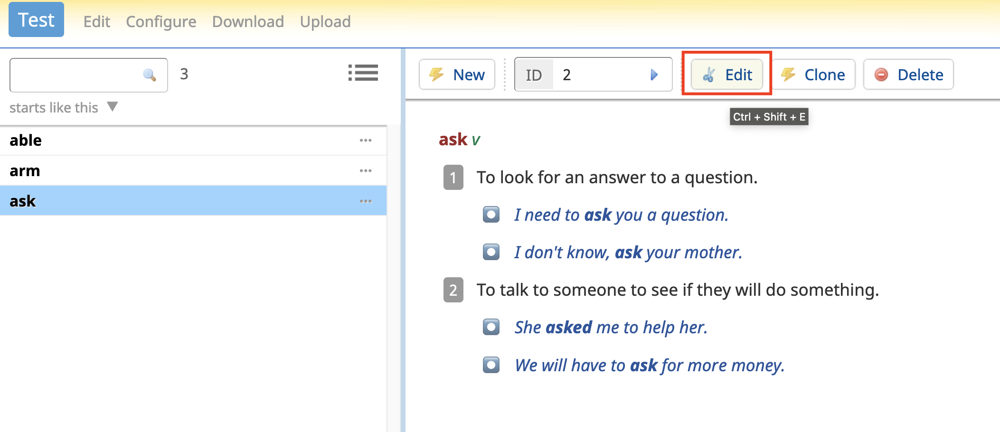

## Useful links

[Introduction to Lexonomy](https://www.lexonomy.eu/docs/intro)

[How to install Lexonomy locally](https://github.com/elexis-eu/lexonomy/blob/master/INSTALL.md)

[Widget API documentation](https://github.com/elexis-eu/lexonomy/wiki/Create-widgets)

## Launching a local installation

1. `cd ./lexonomy/website`

The path in this command depends on where you are; the example assumes that you are in the directory where you cloned the Lexonomy repo from GitHub.

2. `cp siteconfig.json.template siteconfig.json`

Create a config file from template.

3. `python3 ./adminscripts/init.py`

Initialise a database and create the admin user. After running this command, you will see a prompt in the terminal: `I have created a user account for root@localhost. The password is: ******`. **Save this password**, you'll need it to log in!

4. `source ./<ENV>/bin/activate`

\<ENV\> is your environment name. The assumption is that its source files are within `lexonomy/website` directory, otherwise please change the path according to their location.

5. `python3 lexonomy.py`

You can then open `http://127.0.0.1:8080` or `http://localhost:8080/` in your browser and enjoy everything that `https://www.lexonomy.eu/`offers locally. 

## Forking a repo

When you are working on a rather independent feature for a big project, a good practice is to *fork* the project repo, which means creating its independent copy under your own account without losing connection to the original. 

You can always get the latest project updates by pressing `Fetch upstream`. It will get new commits from the `master` branch in the original repo and merge them into yours. 

When you are ready to contribute something to the project, you can create a pull request.

### Changing remote

We cloned the original repo `https://github.com/elexis-eu/lexonomy.git`, so our local `lexonomy` folder is associated with it. Now that we have our own fork, we need to tell git that that's where we want to push local changes.

`git remote set-url origin https://github.com/<YOUR_GITHUB_USERNAME>/lexonomy.git`

Now everything is set for work 😎

## Configuring SketchEngine

### Generating an API key

1. Go to the [SketchEngine login page](https://auth.sketchengine.eu/#login) and choose "Institutional login". Select your university from the list, and you will be redirected to your student/staff login page.

2. Once you're logged in, you'll be redirected back to SketchEngine. Click the three-dot icon at the top-right corner of the screen and select `My account`.

3. Then click the `Generate new API key` button. The API key is a long string of letters and numbers.

### Configuring SketchEngine connection with Lexonomy

1. In Lexonomy, click on your username in the top right corner and select `Your profile`.

2. Paste your username and API key from SketchEngine into blank fields and press `Change` under each of them.

3. Create a sample dictionary using a `Simple Monolingual Dictionary` template.

4. Open the dictionary, select `Configure` and then select `Connection` in the `SketchEngine` menu.

5. Leave the first two links as is. The most important thing here is to select a corpus where you would like to search for examples for your dictionary. You can also specify a concordance query in CQL (SketchEngine's [corpus query language](https://www.sketchengine.eu/documentation/corpus-querying/)) and a couple of other parameters, but it isn't obligatory. See more on this in the [Lexonomy user guide](https://www.lexonomy.eu/docs/intro).

6. Go back to editing your dictionary by pressing the `Edit` button next to `Configure`. Select an entry you would like to edit, and click another `Edit` button to open the entry editor.

You will see the SketchEngine button next to the \<entry\> tag (and any other elements you selected while configuring the connection). Press it and send either a simple or a CQL query to SketchEngine to get a list of examples. Select those you would like to add to the entry.
  

  

